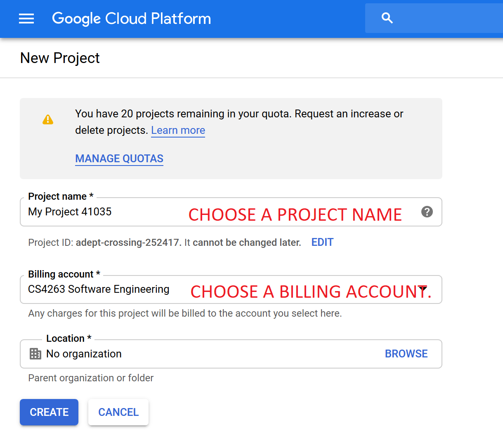
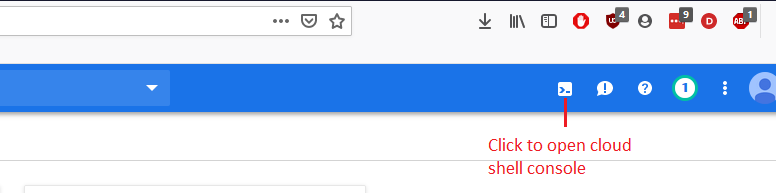
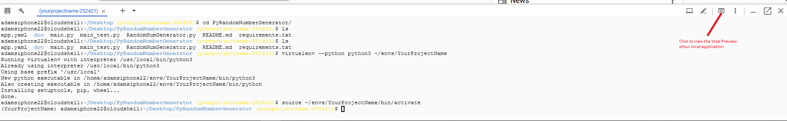

# PyRandomNumberGenerator

This application is written in python using the Flask framework and hosted on Google's app engine


## Set up instructions
Follow these steps to host this application on your own Google cloud account.

1.)  Head to https://console.cloud.google.com and create a free account to use to host the application.  (Be sure to set up a free billing account.)

2.) Once your account is created, go ahead and head to the App Engine dashboard by clicking the hamburger icon in the top left corner and selecting "App Engine" -> "Dashboard."


3.) Click the project drop down arrow at the top left of the page, and click "Create Project" on the dialog menu that appears.


4.) Fill out the the details, choose the billing account you created in step 1. Click "Create Project" when done.



***Note:** You will need your **Project ID** during deployment so please keep note of this. Its found under ```App Engine -> Dashboard -> Project info```

5.) Click the "Activate Cloud Shell" icon at the top right of the page to open the cloud shell console.



6.) Clone the PyRandomNumberGenerator repository to your cloud console by running the following command:  
    ` git clone https://github.com/agracy2246/PyRandomNumberGenerator.git `

7.) Enter the directory you just created by running the following comand:  
    ` cd PyRandomNumberGenerator `

8.) To test your app locally (on the cloud shell), complete the steps:
  * Run the following command to create an isolated virtual environment:
     ` virtualenv --python python3 ~/envs/<YOUR_PROJECT_NAME> `
  * Next, run this command to activate your virtual environment:
     ` source ~/envs/<YOUR_PROJECT_NAME>/bin/activate `
  * Now, we need to install the required modules for the application. We can find this in ` requirements.txt `. Run the following:` pip install -r requirements.txt `
  * Finally, we start our application in the cloud shelll by running the Flask development server:
    ` python main.py `
  * Our application is now running locally! You can preview this local instance by clicking the "Web preview" button on the top right of the console window. Press **Control+c** to end this local instance after you have previewed it.  
  
  

9.) Let's deploy! First we need to create an **application** that we can deploy. Run the following command:  
` gcloud app create `
***Note:** A prompt may ask for the region you would like the application hosted.

10.) The last step is to run the following command:  
` gcloud app deploy app.yaml --project <Your Project ID> `
and enter **'y'** to complete deployment.
***Note:** Use the **Project ID** you took note of in **Step 4**.

# Congratulations!
If you did everything correctly, you can view your application live at ` <Your Project ID>.appspot.com `


	

