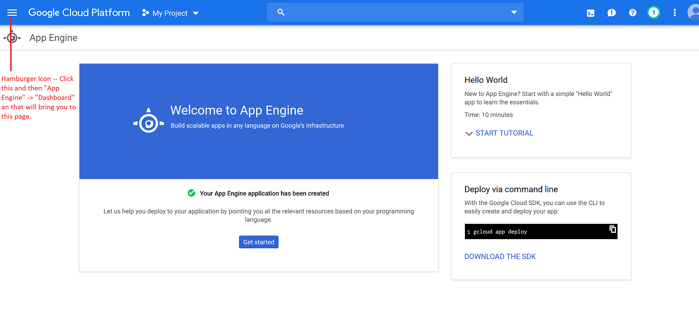

# PyRandomNumberGenerator

This application is written in python using the Flask framework and hosted on Google's app engine

## Set up instructions
Follow these steps to host this application on your own Google cloud account.

1.)  Head to https://console.cloud.google.com and create a free account to use to host the application.  (Be sure to set up a free billing account.)
2.) Once your account is created, go ahead and head to the App Engine dashboard by clicking the hamburger icon in the top left corner and selecting "App Engine" -> "Dashboard."

3.) Click the project drop down arrow at the top left of the page, and click "Create Project" on the dialog menu that appears.

4.) Fill out the the details, choose the billing account you created in step 1. Click "Create Project" when done.

